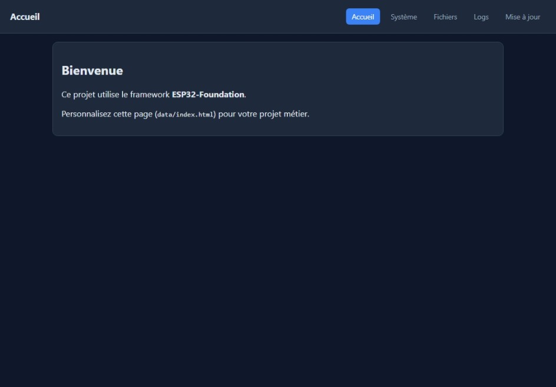
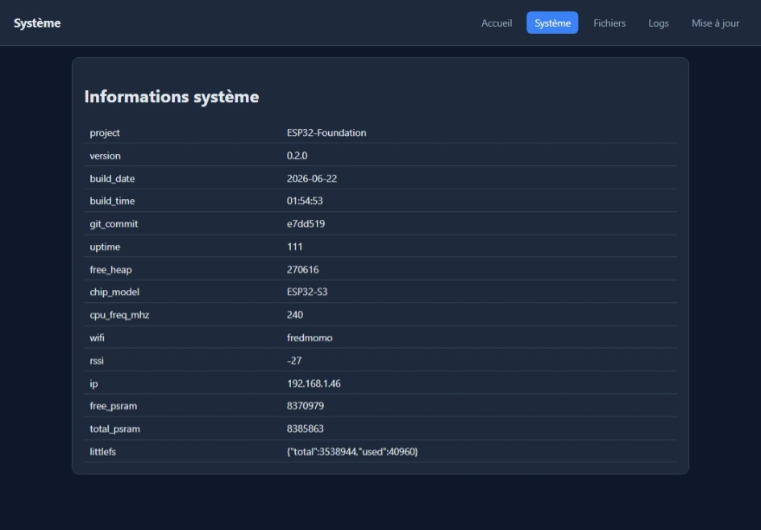
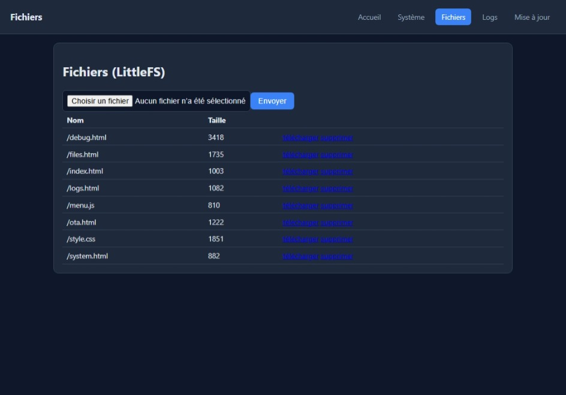
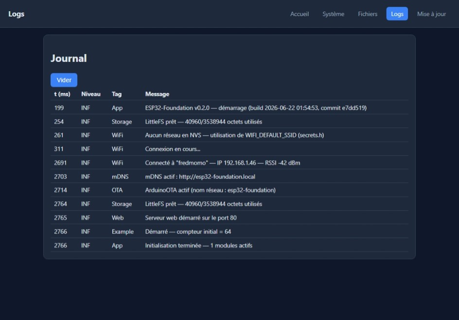
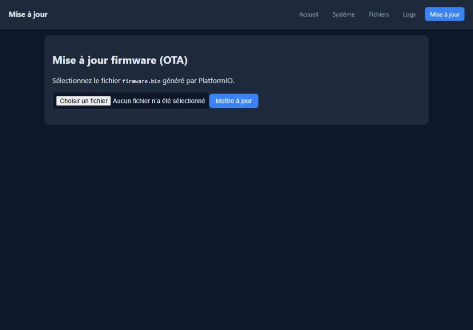

# ESP32-Foundation

Generic application framework for ESP32 projects (PlatformIO / Arduino),
extracted and generalized from **Gateway Lab V1** and **MeteoHub-S3**.

*Lire en français : [README.fr.md](README.fr.md)*

ESP32 Foundation is a reusable application framework, derived from concrete
ESP32 projects such as Gateway Lab and MeteoHub. It provides common services
such as Wi-Fi management, OTA updates, logging, storage, a web interface,
API routing, and build tools, letting new projects focus on the features
specific to their own application.

This framework was not designed first. It was extracted afterwards from
several ESP32 projects, once the components that kept being reused across
them had been identified.

The framework provides the common infrastructure needed by any connected
ESP32 project (WiFi, web server, logs, OTA, storage, persistent
configuration, system information, mDNS, network time) through an optional
**module** system: the framework never knows the business code, and the
business code never knows the service implementation.

## Structure

```
ESP32-Foundation/
├── platformio.ini
├── README.md                       this file
├── README.fr.md                    French version
├── VERSION
├── data/                            web UI (HTML/CSS/JS) served from LittleFS
│       debug.html                  /debug page, served only when ENABLE_BOOT_LOG is on
│       files.html
│       index.html
│       logs.html
│       menu.js
│       ota.html
│       style.css
│       system.html
├── docs/
│       ARCHITECTURE.md
│       BOOT_LOG.md                 optional BootLog module (reboot journal)
│       INTEGRATION_GUIDE.md
├── examples/
│   ├── api/                        API routing example (GET/POST/JSON)
│   │       platformio.ini
│   │       include/project_config.h
│   │       src/api_module.cpp, api_module.h, main.cpp
│   ├── example_project/            historical example (the "Blink" module)
│   │       platformio.ini
│   │       include/project_config.h
│   │       src/blink_module.cpp, blink_module.h, main.cpp
│   ├── minimal/                    simplest possible example (lifecycle only)
│   │       platformio.ini
│   │       include/project_config.h
│   │       src/main.cpp, minimal_module.cpp, minimal_module.h
│   └── sensor/                     simulated sensor + persistent setting example
│           platformio.ini
│           include/project_config.h
│           src/main.cpp, sensor_module.cpp, sensor_module.h
├── include/
│       board_config.h              generic pin mapping
│       project_config.h            global framework settings
│       secrets_example.h           template for include/secrets.h (gitignored)
├── src/
│   │   main.cpp                    entry point of the root project
│   ├── api/
│   │   └── api_router/
│   │           api_router.h        WebRouter
│   ├── core/
│   │       app.cpp, app.h          App orchestrator
│   │       module.h                Module base class
│   │       module_manager.h        ModuleManager
│   ├── modules/
│   │   ├── example_module/
│   │   │       example_module.cpp, example_module.h
│   │   └── boot_log/                optional, disabled by default — see docs/BOOT_LOG.md
│   │           boot_log.cpp, boot_log.h
│   └── services/
│       ├── config_manager/         config_manager.cpp, config_manager.h
│       ├── log_manager/            log_manager.cpp, log_manager.h
│       ├── mdns_manager/           mdns_manager.cpp, mdns_manager.h
│       ├── ota_manager/            ota_manager.cpp, ota_manager.h
│       ├── storage_manager/        storage_manager.cpp, storage_manager.h
│       ├── system_info/            system_info.cpp, system_info.h
│       ├── time_manager/           time_manager.cpp, time_manager.h
│       ├── web_manager/            web_manager.cpp, web_manager.h
│       └── wifi_manager/           wifi_manager.cpp, wifi_manager.h
└── tools/
        build_info.py
        minify_web.py
        package_web.py
        release.py
        version_generator.py
```

## Quick start

```bash
cp include/secrets_example.h include/secrets.h   # development WiFi credentials (optional)
pio run                                            # build the firmware
pio run --target uploadfs                          # flash data/ (web UI)
pio run --target upload                            # flash the firmware
```

Important: run `pio run -t uploadfs` at least once after the very first
flash (and again every time `data/` changes) — without this step, the
LittleFS web UI is empty and every page returns blank or a 404, even though
the firmware itself runs correctly. See the detailed explanation in
[docs/INTEGRATION_GUIDE.md](docs/INTEGRATION_GUIDE.md#téléverser-linterface-web-littlefs--éviter-la-page-blanche-au-premier-démarrage)
(currently documented in French — translation contributions welcome).

To rename the project (logs, `/api/system`, web UI), see the
[Renommer le projet](docs/INTEGRATION_GUIDE.md#renommer-le-projet) section of
the integration guide.

See [docs/INTEGRATION_GUIDE.md](docs/INTEGRATION_GUIDE.md) to start a new
project, and [docs/ARCHITECTURE.md](docs/ARCHITECTURE.md) for the design
choices and where they come from (Gateway Lab / MeteoHub).

## Provided examples

| Example | Description |
|---|---|
| `examples/example_project/` | Minimal "Blink" module driving the onboard LED — historical reference example. |
| `examples/minimal/` | The simplest possible module: `begin()`/`loop()` lifecycle only, no sensor and no HTTP route. Read this one first. |
| `examples/sensor/` | Periodic reading of a simulated value, configurable and persistent read interval, `GET /api/sensor/value` HTTP route. |
| `examples/api/` | Three demonstration HTTP routes via `WebRouter`: plain GET, GET with a query parameter, POST with a JSON body and validation. |

Each example is a standalone PlatformIO project (see its own
`platformio.ini`, which references the framework via
`lib_extra_dirs = ../../`). The full, step-by-step guide for building a
custom module from these examples lives in
[docs/INTEGRATION_GUIDE.md](docs/INTEGRATION_GUIDE.md#créer-son-premier-module-pas-à-pas).

## Provided services

| Service          | Role                                                          |
|-------------------|---------------------------------------------------------------|
| `wifiMgr`         | Multi-network NVS storage, fallback captive portal, auto-reconnect |
| `webMgr`          | HTTP server: `/`, `/logs`, `/files`, `/system`, `/ota`         |
| `otaMgr`          | Firmware updates (ArduinoOTA + web upload)                    |
| `storage`         | LittleFS files (read/write/list/delete)                       |
| `config`          | Persistent key/value settings (NVS)                           |
| `logMgr`          | Serial logs + JSON buffer (`LOG_INFO`, `LOG_ERROR`, ...)       |
| `systemInfo`      | System state as JSON (heap, version, WiFi, build...)          |
| `mdnsMgr`         | `http://<hostname>.local` resolution                          |
| `timeMgr`         | NTP synchronization                                            |

No business dependency is imposed: each service can be used independently
of the others.

## Optional modules

| Module | Role |
|---|---|
| `exampleModule` | Minimal demonstration module (`src/modules/example_module/`), always on. |
| `bootLogModule` | Reboot journal (reset reason, last logs, system snapshot before crash). **Disabled by default**, enable with `#define ENABLE_BOOT_LOG` in `include/project_config.h`. The `/debug` nav link appears automatically (`data/menu.js` probes `GET /api/bootlog`) — no menu edit needed either way. A concrete, fully removable example module — see [docs/BOOT_LOG.md](docs/BOOT_LOG.md) (currently documented in French — translation contributions welcome). |

## Screenshots

| Page | Screenshot |
|---|---|
| Home (`/`) |  |
| System (`/system`) |  |
| Files (`/files`) |  |
| Logs (`/logs`) |  |
| Update (`/ota`) |  |

## License

Distributed under the [MIT License](LICENSE).
